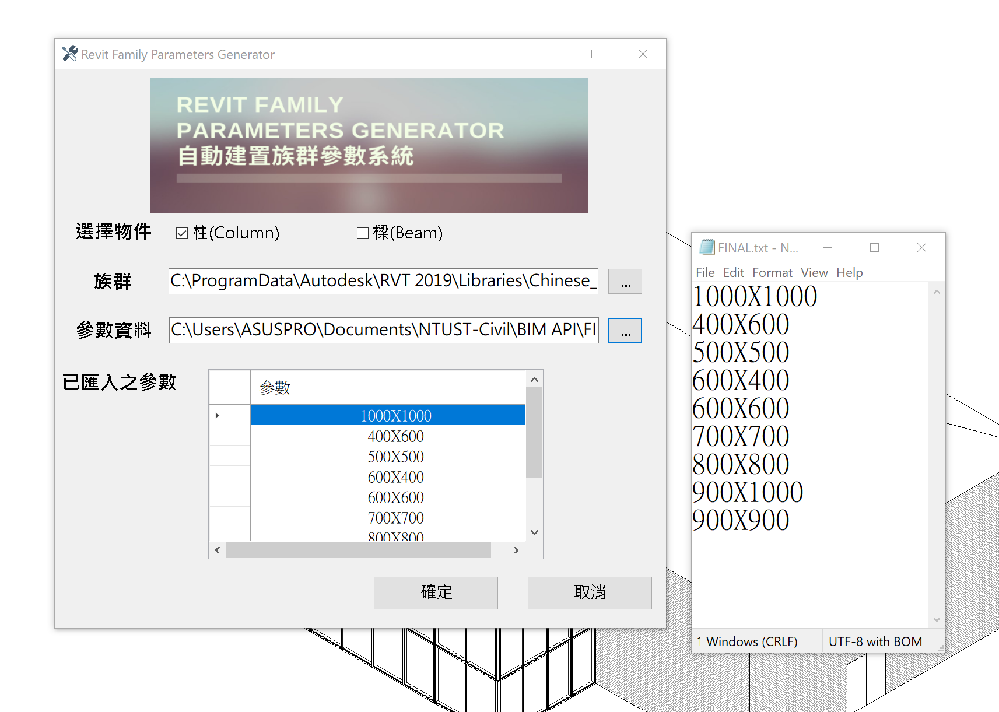
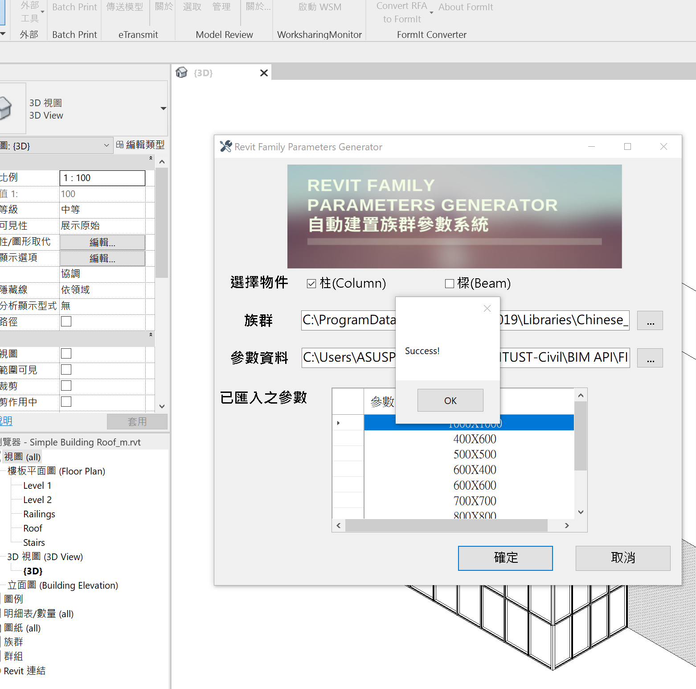

# BIMAPI_Revit-Family-Parameters-Generator

This project aims to address the automatic modeling needs of beams and columns in large-scale construction projects. In these large BIM (Building Information Modeling) projects, there are various sizes and specifications of beams and columns that need to be modeled according to structural design requirements and the complexity of the building's structure. Traditional manual modeling methods are not only time-consuming but also prone to errors and are difficult to manage systematically. Therefore, this project utilizes the Revit API to automate the generation of different size types for beams and columns, aiming to improve efficiency and ensure consistency.

## Key features and advantages of this project include:

Automatic Modeling: The program can automatically create beams and columns in the Revit model based on information provided in the structural dimension table, typically in CAD format, eliminating the need for manual modeling.

Size Type Generation: The program can generate different size types of beams and columns based on the provided dimension data, contributing to ensuring diversity and accuracy in the model.

Increased Efficiency: This automation method significantly saves modeling personnel a substantial amount of time and effort, especially in large projects.

Reduced Error Rate: Automatic modeling can reduce human errors, ensuring the accuracy of the dimensions, and improving modeling quality.

Ease of Maintenance: Automatically generated models are easier to maintain in the long run since they are generated based on consistent specifications.

